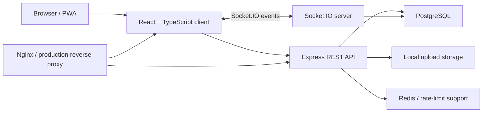

<h1 align="center">Zokul</h1>

<p align="center">
  <strong>Mobile-first realtime messenger built as a full-stack production-ready web app.</strong>
</p>

<p align="center">
  <a href="https://zokul.zhichkin.space">Live Demo</a>
  ·
  <a href="#features">Features</a>
  ·
  <a href="#architecture">Architecture</a>
  ·
  <a href="#local-development">Local Development</a>
  ·
  <a href="#documentation">Documentation</a>
</p>

<p align="center">
  
  
  
  
  
  
</p>

<p align="center">
  
</p>

## Overview

Zokul is a realtime web messenger with a clean dark interface, responsive layout, voice messages, media sharing, online presence, and Docker-based deployment.

The project is designed as a real product rather than a UI prototype: it has a client, API server, database, realtime transport, file uploads, production compose files, release scripts, tests, and project documentation for AI-assisted development.

## Features

- Realtime private and group chats powered by Socket.IO.
- Text messages, image attachments, multiple image upload, replies, editing, and deletion.
- Voice messages with browser recording and audio playback.
- Online status, typing states, and message delivery/read-state foundation.
- User profile editing with avatar upload.
- Dark and soft-light themes.
- Mobile-first responsive messenger layout.
- PWA-ready frontend for app-like browser usage.
- Rate limiting, validation, authentication, and production-oriented server configuration.
- Docker Compose environments for local and production checks.

## Screenshots

### Chat Experience

<p align="center">
  
</p>

### Authentication

<p align="center">
  
</p>

## Architecture



## Tech Stack

| Layer | Technology |
| --- | --- |
| Frontend | React, TypeScript, Vite, PWA |
| Realtime | Socket.IO |
| Backend | Node.js, Express |
| Database | PostgreSQL |
| Cache / limits | Redis |
| Storage | Local uploads volume |
| Deployment | Docker, Docker Compose, Nginx |
| Quality | Unit/integration tests, release scripts, project protocol docs |

## Local Development

Install dependencies:

```bash
npm install
npm install --prefix client
npm install --prefix server
```

Run the client and server in development mode:

```bash
npm run dev
```

Run tests:

```bash
npm test
```

Build the project:

```bash
npm run build
```

## Docker Check

Run the local Docker environment:

```bash
docker compose -f docker-compose.local.yml up -d --build
```

Open:

```text
http://localhost
```

Stop containers:

```bash
docker compose -f docker-compose.local.yml down
```

## Production Deployment

Production deployment is prepared through the dedicated production branch and compose file.

```bash
git checkout production
docker compose -f docker-compose.prod.yml up -d --build
```

For a clean production start, use the release script only when you intentionally want to remove runtime data:

```bash
powershell -ExecutionPolicy Bypass -File scripts/prepare-release.ps1 -FreshServerData
```

Secrets, certificates, and runtime `.env` files are not stored in the repository.

## Documentation

The repository includes a project documentation protocol in [`docs/`](docs/). It is used to keep architecture, decisions, task handoffs, project state, and AI-agent work logs consistent.

Useful entry points:

- [`docs/00_README_FOR_AGENTS.md`](docs/00_README_FOR_AGENTS.md) - how agents should navigate and maintain the project documentation.
- [`docs/CONTROL_PLANE.md`](docs/CONTROL_PLANE.md) - current project state and operational control panel.
- [`docs/PROJECT_MAP.md`](docs/PROJECT_MAP.md) - architecture and module map.
- [`docs/tasks/active/NEXT_AGENT_TASK.md`](docs/tasks/active/NEXT_AGENT_TASK.md) - current implementation handoff, when active.

## Repository Model

- `master` - main source branch with code and documentation.
- `production` - deployable branch for server updates.

The project keeps generated artifacts, runtime uploads, local reports, and secrets out of Git.

## Roadmap

- Improve read receipts and message state clarity.
- Add user profile viewing for chat participants.
- Expand group chat controls.
- Add an admin panel for moderation and operational visibility.
- Continue strengthening automated tests around realtime and media flows.

## Project Status

Zokul is actively developed as a portfolio-grade full-stack messenger. The current focus is product polish, stable deployment, clean documentation, and a workflow where planning and implementation can be safely split between different AI agents.
