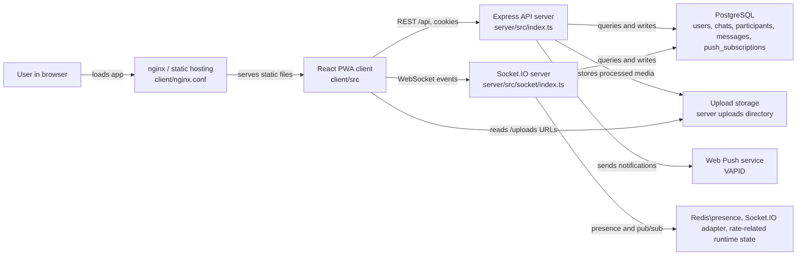
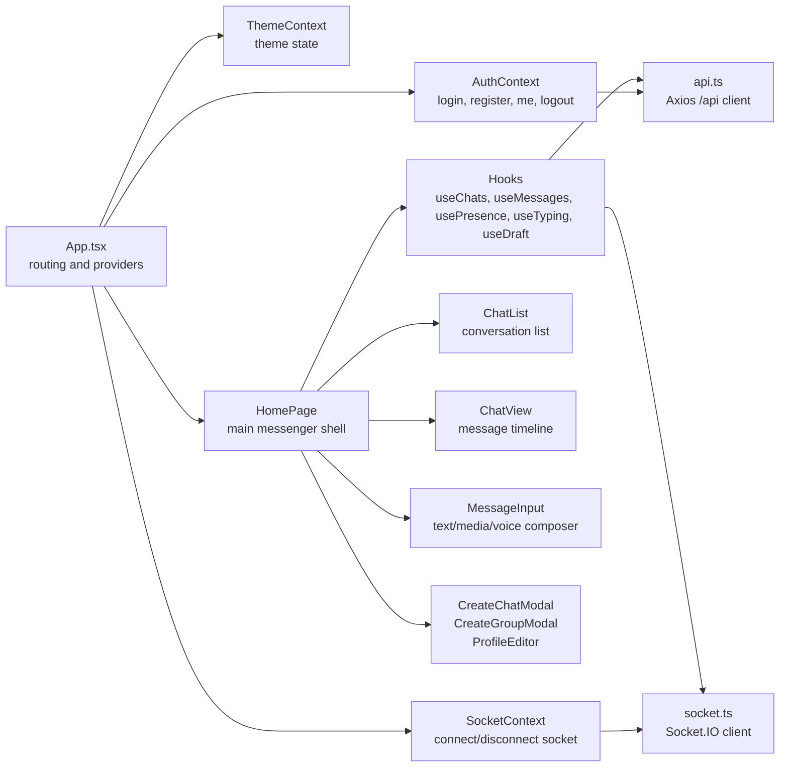
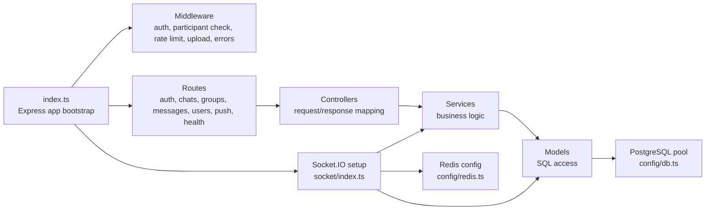
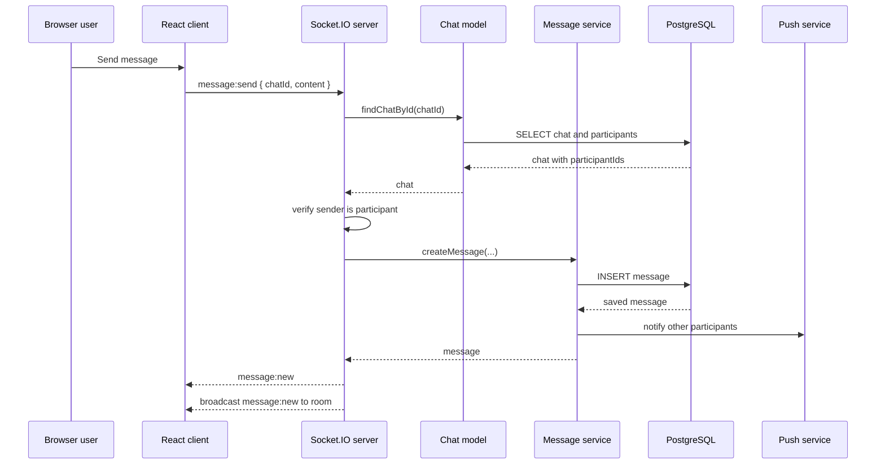
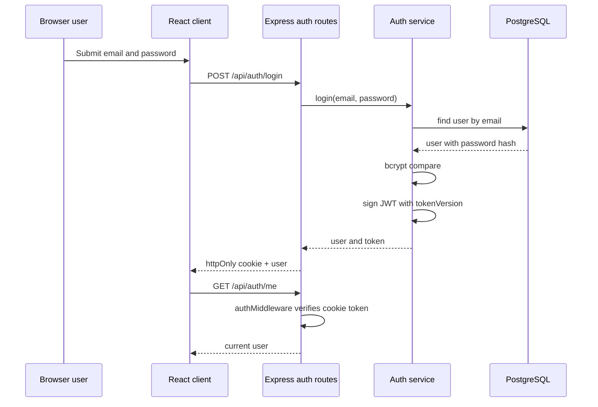
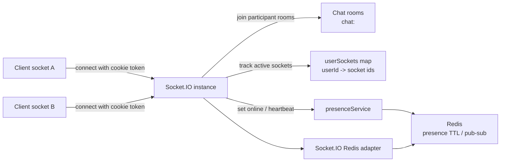
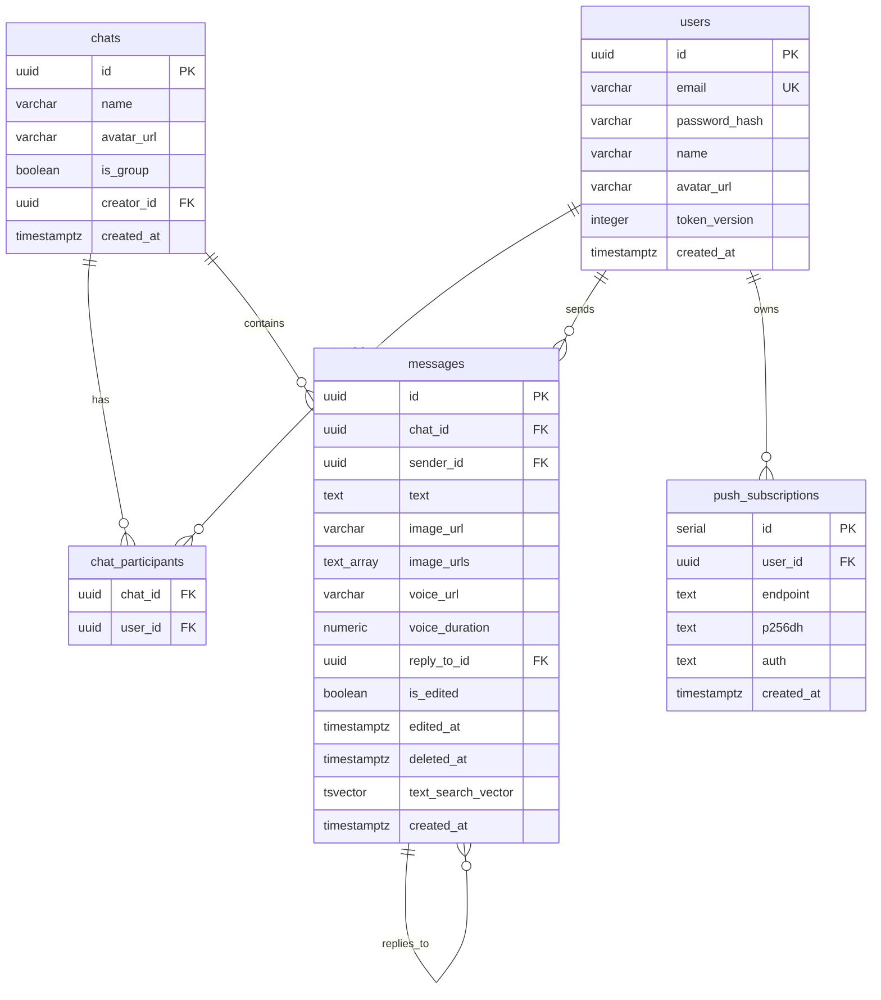
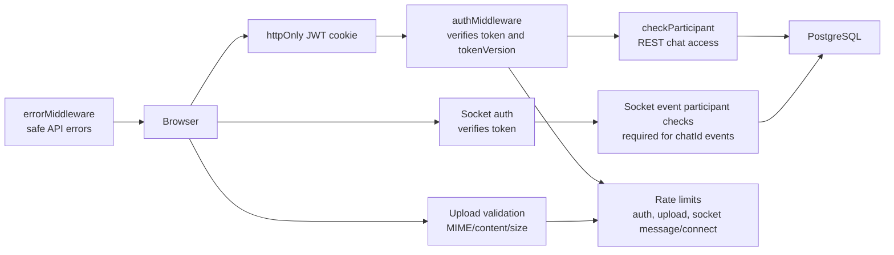
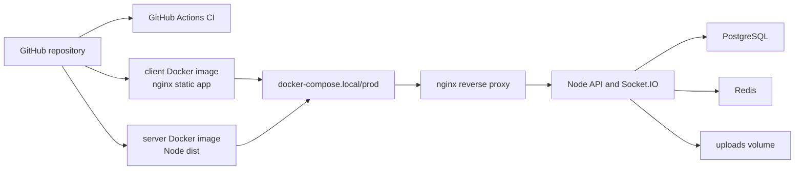
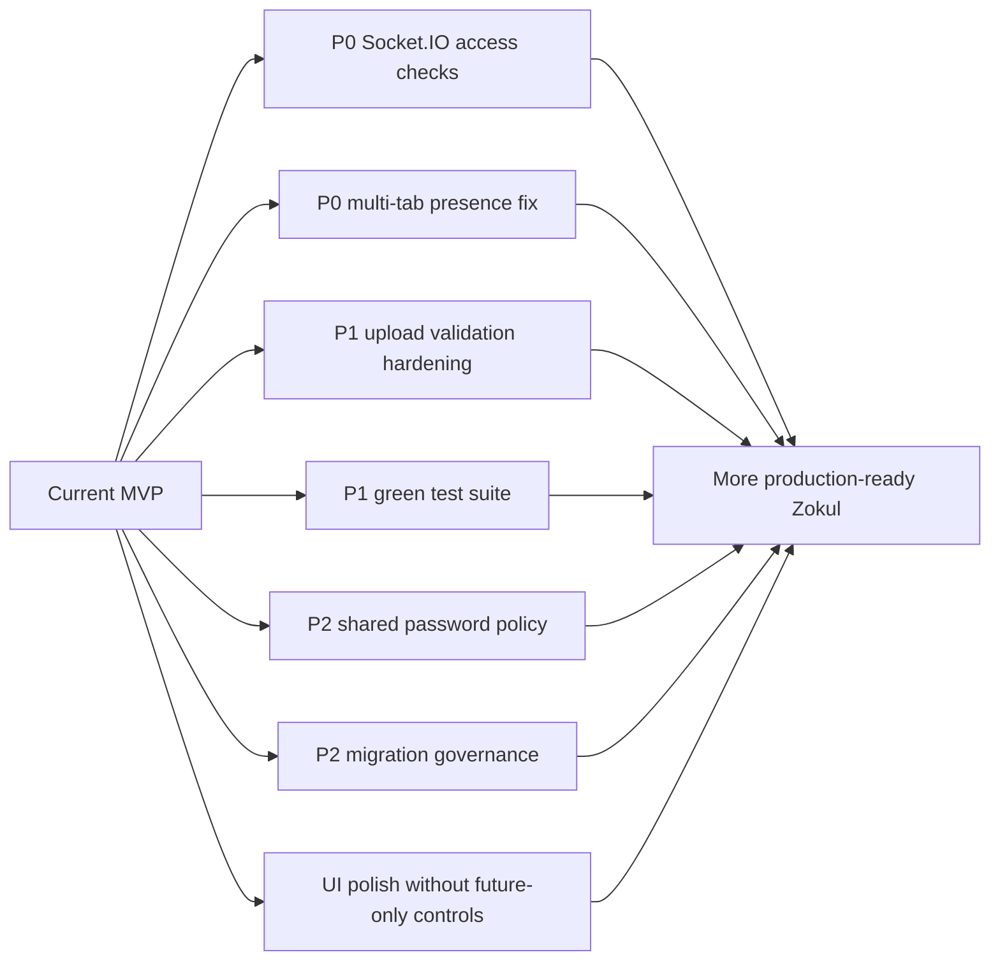

# Zokul: architecture map source

## Purpose

This file is the version-controlled source for the Zokul architecture map.

Use it as the canonical project-state map. The FigJam/Figma version can be regenerated or manually adjusted from these diagrams when the architecture changes.

## Maintenance rules

- Update this file when project structure, runtime services, data flows, or deployment topology changes.
- Keep diagrams honest: do not show future features as current architecture.
- If a feature is planned but not implemented, mark it as `Planned`, not as an active component.
- Keep diagrams readable. Prefer several focused maps over one huge unreadable graph.
- When a FigJam board is created from this file, paste its URL here.

FigJam board:

```text
https://www.figma.com/board/HxH5zyqL0H0Cxp44gmb7wu?utm_source=other&utm_content=edit_in_figjam&oai_id=v1%2FuRBrGTs3WmdYbmG7LAJCkyWXLGBB3tyr1hVThXwdjfSj65Dgnb7BDq&request_id=445ce9b9-cfac-4bdf-b8e7-4bfb384d84b7
```

## 01. System overview



## 02. Client architecture



## 03. Backend architecture



## 04. Message send flow



## 05. Auth flow



## 06. Realtime and presence



## 07. Data model



## 08. Security boundaries



## 09. Deployment map



## 10. Current improvement map


