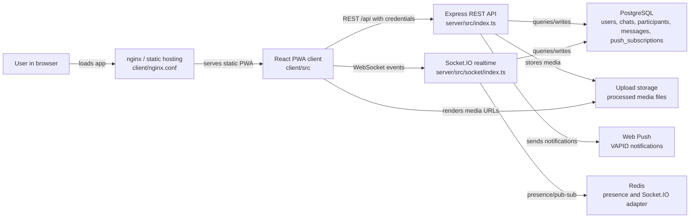
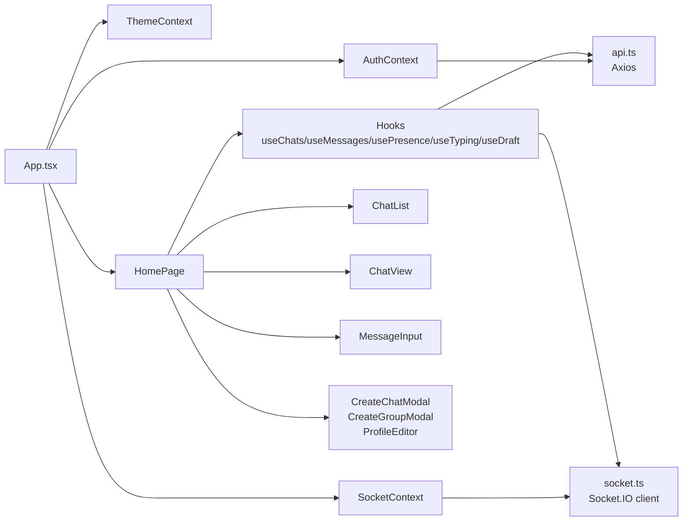
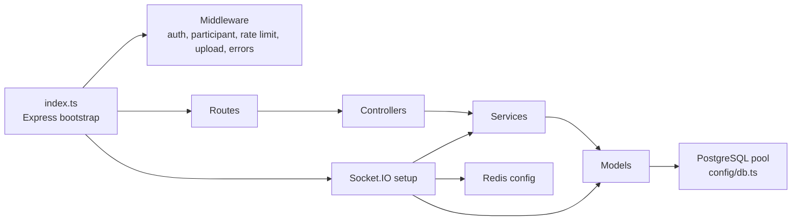
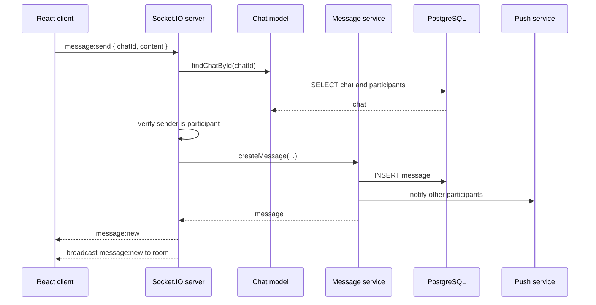
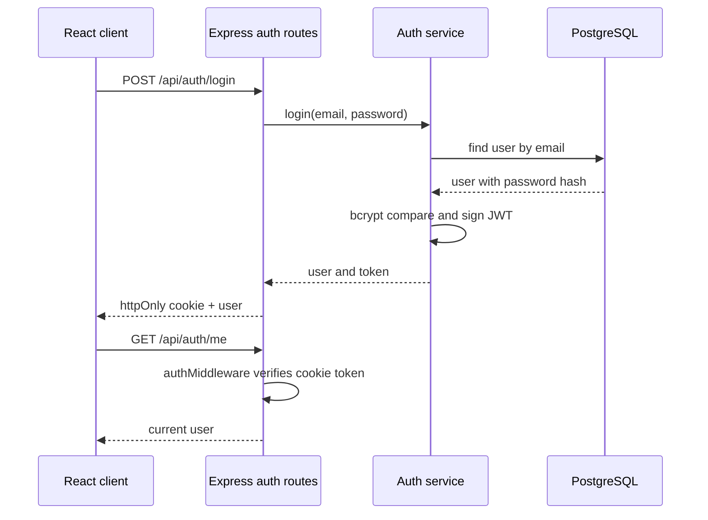
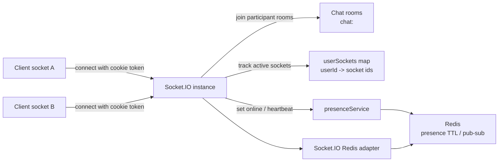
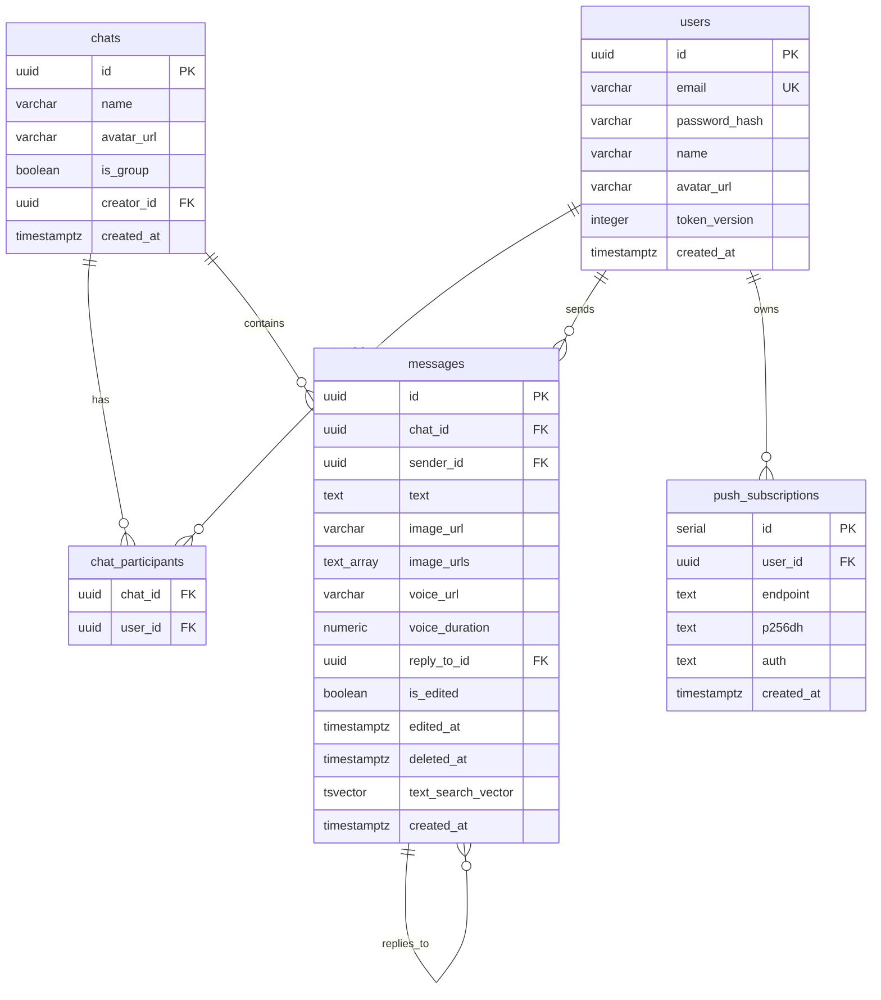
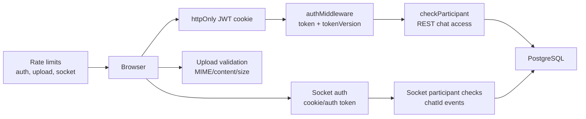
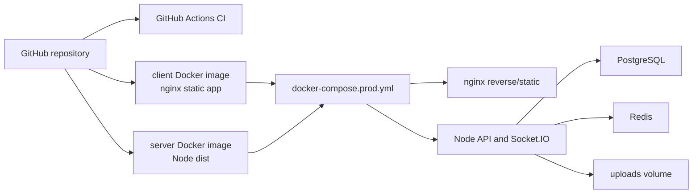

# Architecture Map

Last reviewed: 2026-07-17
Source commit: 96d5818

FigJam overview board:

```text
https://www.figma.com/board/HxH5zyqL0H0Cxp44gmb7wu?utm_source=other&utm_content=edit_in_figjam&oai_id=v1%2FuRBrGTs3WmdYbmG7LAJCkyWXLGBB3tyr1hVThXwdjfSj65Dgnb7BDq&request_id=445ce9b9-cfac-4bdf-b8e7-4bfb384d84b7
```

Mermaid in this file is the source of truth.

## System Overview



## Client Architecture



## Backend Architecture



## Message Send Flow



## Auth Flow



## Realtime And Presence



## Data Model



## Security Boundaries



## Deployment



## Code Structure

### Root

| Path | Purpose |
|---|---|
| `client/` | React/Vite PWA frontend |
| `server/` | Express/Socket.IO backend |
| `docs/` | Project documentation, AI workflow memory, gates, prompts, and task archive |
| `scripts/` | Deployment/backup helper scripts |
| `.github/workflows/ci.yml` | CI for client/server |
| `docker-compose.local.yml` | Local Docker topology |
| `docker-compose.prod.yml` | Production Docker topology |
| `.env.example` | Environment variable example |

### Client

| Path | Purpose |
|---|---|
| `client/src/App.tsx` | App routing/providers entry |
| `client/src/components/` | UI components |
| `client/src/components/auth/` | Login/register forms |
| `client/src/components/chat/` | Chat list, chat view, message input, media, voice |
| `client/src/components/common/` | Reusable Avatar/Button/Modal/ErrorBoundary |
| `client/src/components/layout/` | App shell |
| `client/src/components/profile/` | Profile editor |
| `client/src/contexts/` | Auth, Chat, Socket, Theme contexts |
| `client/src/hooks/` | Chat, presence, typing, draft, pagination, push hooks |
| `client/src/services/` | Axios API and Socket.IO client |
| `client/src/types/` | Shared client types |
| `client/__tests__/` | Vitest component/context tests |

### Server

| Path | Purpose |
|---|---|
| `server/src/index.ts` | Express app, routes, upload endpoints, startup/shutdown |
| `server/src/config/` | App config, DB pool/migrate, Redis |
| `server/src/routes/` | Express route declarations |
| `server/src/controllers/` | HTTP request/response handlers |
| `server/src/services/` | Business logic |
| `server/src/models/` | PostgreSQL access/mapping |
| `server/src/middleware/` | Auth, participant checks, upload, rate limit, error handling |
| `server/src/socket/index.ts` | Socket.IO auth, rooms, realtime events, presence |
| `server/src/utils/` | Logger |
| `server/__tests__/` | Jest tests |

### Critical Files

- `server/src/socket/index.ts`: realtime auth, chat rooms, message events, presence.
- `server/src/middleware/authMiddleware.ts`: token verification and tokenVersion revocation.
- `server/src/middleware/uploadMiddleware.ts`: upload MIME whitelist.
- `server/src/middleware/processImage.ts`: image/avatar processing and cleanup.
- `server/src/config/db.ts`: runtime schema creation/migration.
- `client/src/components/HomePage.tsx`: main messenger shell.
- `client/src/components/chat/ChatView.tsx`: message timeline.
- `client/src/components/chat/MessageInput.tsx`: message composer.

### Generated Or Risky Files

Do not stage without explicit reason:

- `node_modules/`
- `dist/`
- `.env`
- `uploads/`
- `*.log`
- `client/tsconfig*.tsbuildinfo`
- `client/vite.config.js`
- `client/vite.config.d.ts`
- `reports/`
- `server/test-uploads/`
- generated build outputs
